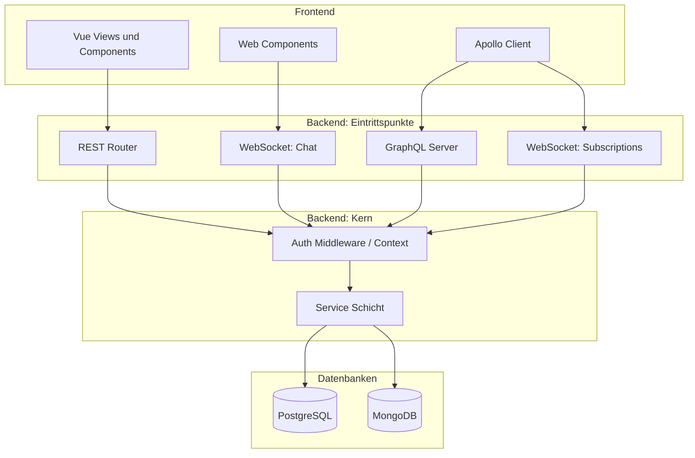
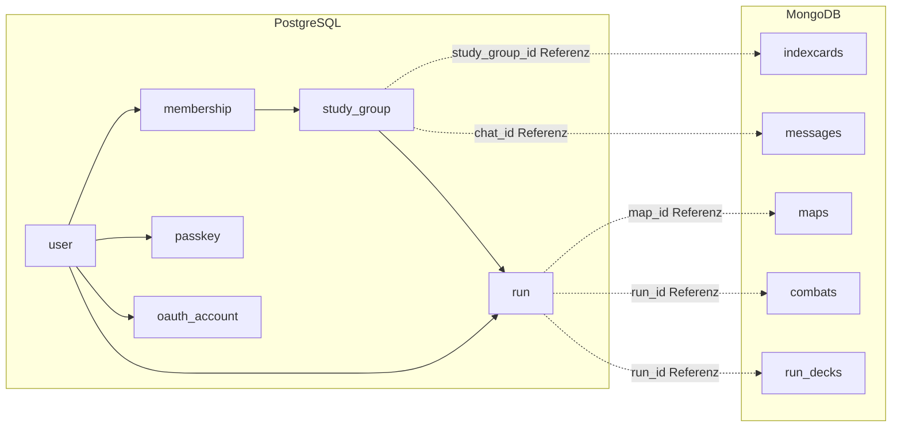
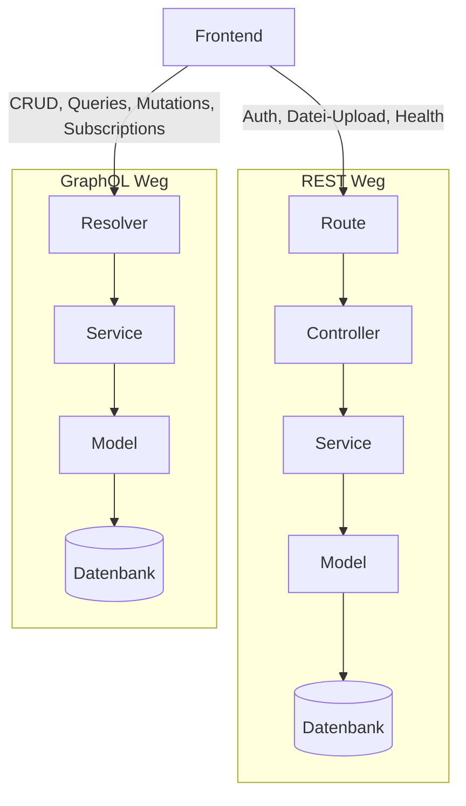

# Technische Dokumentation: Architektur & Datenbanken

## 1. Architekturüberblick der Gesamtanwendung

### 1.1 Grobarchitektur

Die Anwendung folgt einer klassischen Client-Server-Trennung mit einem Node.js/Express-Backend und einem Vue-3-Frontend, verbunden über drei parallele Kommunikationswege: REST, GraphQL und einen rohen WebSocket für den Chat.



### 1.2 Schichtenarchitektur

Innerhalb des Backends gilt durchgängig dasselbe Muster, unabhängig davon, ob eine Anfrage über REST oder GraphQL hereinkommt:

```
Route/Resolver → Controller/Resolver → Service → Model → Datenbank
```

Controller (REST) und Resolver (GraphQL) rufen ausschließlich Services auf, nie direkt Datenbank-Modelle. Das hat zwei Konsequenzen:

- Geschäftslogik (z. B. Berechtigungsprüfung, Kampf-Mathematik, Deck-Verwaltung) liegt an genau einer Stelle und wird von beiden Schnittstellen gleichermaßen genutzt — REST und GraphQL sind austauschbare Zugänge zur selben Logik, keine zwei parallelen Implementierungen.
- Bei MongoDB greifen Services aus Pragmatismus direkt auf Mongoose-Models zu, ohne zusätzlichen Repository-Layer, da Mongoose selbst bereits die Abstraktionsebene zur Datenbank darstellt.

Services dürfen sich gegenseitig aufrufen, wenn fachliche Logik zusammengehört (z. B. nutzt `combat.service.js` auch `indexCard.service.js` für Statistik-Updates nach einer beantworteten Karte). Um zirkuläre Imports zwischen zwei Services zu vermeiden, wurden gemeinsam genutzte, reine Berechnungsfunktionen ohne Seiteneffekte in eine neutrale Utility-Datei ausgelagert (`utils/playerStats.util.js`), statt dass sich zwei Services direkt gegenseitig importieren.

### 1.3 Realtime-Kommunikation: zwei getrennte WebSocket-Server

Ein technischer Sonderfall der Architektur: GraphQL Subscriptions (`graphql-ws`) und der Chat laufen über zwei unabhängige WebSocket-Server auf demselben HTTP-Server. Die `ws`-Library hat einen bekannten Bug, bei dem eine zweite `WebSocketServer`-Instanz mit `path`-Option den `upgrade`-Handler der ersten überschreibt — einer der beiden Server würde sonst gar keine Verbindungen mehr annehmen. Gelöst wurde das mit `noServer: true` für beide Server und manuellem Routing über den `upgrade`-Event des `httpServer`, das anhand des URL-Pfads (`/graphql` vs. `/chat`) entscheidet, welcher Server die Verbindung übernimmt.

### 1.4 Ordnerstruktur als Architektur-Spiegel

Die Ordnerstruktur des Backends bildet die Schichtenarchitektur 1:1 ab:

```
src/
├── api/rest/          REST: routes, controllers, middleware
├── graphql/            resolvers, context, pubsub
├── services/           Geschäftslogik (auth, chat, combat, permission, ...)
├── models/
│   ├── sql/             PostgreSQL-Modelle
│   └── mongo/           MongoDB-Modelle (Mongoose)
└── realtime/            WebSocket-Server und Handler
```

Frontend-seitig ist die Trennung analog: `components/` für Vue-Komponenten, `web-components/` für die beiden Custom Elements, `apollo/` und `composables/` für den Offline-Layer, `services/` für IndexedDB-Zugriff.

## 2. Verwendete Datenbanken und Begründung der Datenmodellierung

### 2.1 Zwei Datenbanken, eine bewusste Aufteilung

| Datenbank | Verwendet für | Grundprinzip |
| --- | --- | --- |
| PostgreSQL | `user`, `passkey`, `oauth_account`, `webauthn_challenge`, `study_group`, `membership`, `run` | Klare, relationale Beziehungen mit Fremdschlüsseln; überwiegend skalare Felder |
| MongoDB | `indexcards`, `messages`, `maps`, `combats`, `run_decks` | Verschachtelte, variable oder dokumentenorientierte Strukturen |

Die Aufteilung folgt einem klaren Kriterium: **Wie stark sind die Daten strukturell fest vs. wie stark variieren sie in Form und Verschachtelung?**

### 2.2 Begründung je Entität

**In PostgreSQL, weil relational und skalar:**

- `run` enthält ausschließlich skalare Werte (Level, HP, Position, Zähler) und hat klare 1:n-Beziehungen zu `user` und `study_group` über Fremdschlüssel. Der laufende Spieler-Zustand (Level, HP) wurde bewusst nicht in eine eigene `Player`-Tabelle ausgelagert, da er 1:1 an genau einen Run gebunden ist und nie unabhängig davon existiert — eine zusätzliche Tabelle hätte hier nur einen weiteren Join ohne fachlichen Mehrwert erzeugt.
- `membership` ist eine klassische n:m-Zwischentabelle (User ↔ Lerngruppe) mit einem zusätzlichen skalaren Attribut (`role`), eine klare relationale Struktur.
- `passkey`/`oauth_account` sind 1:n an `user` gebunden, mit festen, immer gleich aufgebauten Feldern (Credential-ID, Public Key, Provider-Infos).

**In MongoDB, weil verschachtelt oder variabel:**

- `indexcards` haben variable, verschachtelte Inhalte: ein Array von Tags beliebiger Länge, ein Array von Dateianhängen, und zwei Arrays von Statistik-Objekten (`group_stats` pro Lerngruppe, `user_stats` pro Nutzer). Eine rein relationale Abbildung hätte für jedes dieser Arrays eine eigene Tabelle mit Fremdschlüssel gebraucht, ohne dass sich die zusätzliche Normalisierung fachlich gelohnt hätte, da diese Daten immer nur gemeinsam mit der Karte gelesen werden.
- `maps` wurde bewusst nachträglich von einer ursprünglich geplanten SQL-Struktur (`map`/`field`/`enemy` als drei Tabellen) nach MongoDB verschoben: Felder mit eingebetteten Gegnern, Koordinaten und einer Liste erreichbarer Folgefelder (`nextFields`) sind als verschachteltes Dokument natürlicher abzubilden als über mehrere per Fremdschlüssel verknüpfte Tabellen, besonders im Hinblick auf eine mögliche künftige Random-Map-Generierungsfunktion, ergab der Wechsel in die MongoDB mehr Sinn für uns.
- `combats` und `run_decks` sind kurzlebige, verschachtelte Zustandsobjekte (Handkarten-Array, eingebettetes Gegner-Objekt) ohne eigene Zeithistorie. Auch hier passt ein Dokumentmodell besser als starre SQL-Tabellen.
- `messages` sind der einzige Grenzfall in dieser Aufteilung: strukturell (feste Felder, klare Referenz auf `chat_id`) hätten sie auch gut in eine SQL-Tabelle gepasst. Die Entscheidung für MongoDB war hier eher pragmatisch als zwingend durch das Kriterium aus Abschnitt 2.1 begründet. Nachrichten liegen fachlich nah an anderen kurzlebigen, Echtzeit-nahen Collections (`combats`) und wurden aus Konsistenz ebenfalls dort abgelegt, statt für eine einzelne, einfache Tabelle eine dritte Datenquelle im selben Feature-Bereich zu pflegen.

### 2.3 Referenzen zwischen den beiden Datenbanken

Da es keine gemeinsame Transaktionsgrenze zwischen PostgreSQL und MongoDB gibt, werden Verweise zwischen beiden Systemen als einfache ID-Referenzen ohne referenzielle Integrität auf Datenbankebene gehalten:

- `study_group.chat_id` (SQL) verweist auf ein MongoDB-Dokument in `messages`/den zugehörigen Chat, ist aber kein klassischer Fremdschlüssel.
- `indexcards.study_group_id` und `run_decks.run_id`/`combats.run_id` (MongoDB) verweisen umgekehrt auf SQL-Zeilen.

Konsistenz wird hier bewusst nicht über Datenbank-Constraints, sondern über die Service-Schicht sichergestellt (z. B. wird beim Löschen einer Lerngruppe serverseitig auch das zugehörige Chat-Dokument berücksichtigt).

### 2.4 Berechnete statt gespeicherte Werte

Ein wiederkehrendes Muster in der Datenmodellierung: abgeleitete Werte werden bewusst **nicht** gespeichert, sondern bei Bedarf live berechnet, um Inkonsistenzen zwischen Rohdaten und abgeleitetem Wert zu vermeiden:

- Karten-Schwierigkeit: `correct_answers / total_attempts` aus `group_stats`, nie als eigenes Feld persistiert.
- `run.hit_rate` existiert nicht als Spalte, sondern wird immer aus `correct_answers / total_answers` berechnet.
- Rangliste: kein eigenes Datenbankmodell, sondern eine Live-Filterung/Sortierung direkt auf `run`.

### 2.5 Diagramm: Datenfluss über beide Datenbanken



## 3. Rolle von REST und GraphQL

### 3.1 Aufteilung nach Zweck, nicht nach Zufall

| Schnittstelle | Verantwortlich für |
| --- | --- |
| REST | Authentifizierung (OAuth-Redirect, Passkey-Registrierung/Login), Datei-Upload/-Download (Multipart Form Data), Health Check |
| GraphQL | Sämtliche CRUD-Operationen auf fachlichen Daten, flexible Abfragen (Filter, Suche), Echtzeit-Updates über Subscriptions |

Die Aufteilung folgt einem einfachen Kriterium: REST für alles, was technisch nicht gut zu GraphQL passt (Redirects, Binärdaten, einfache Statusabfragen), GraphQL für alles, was von flexiblen, typisierten Abfragen und Live-Updates profitiert.

**Warum nicht alles REST oder alles GraphQL:**

- OAuth-Redirects (`302`-Antworten) und Multipart-Datei-Uploads passen nicht in das GraphQL-Anfrage/Antwort-Modell, das auf JSON über einen einzigen Endpunkt ausgelegt ist. REST bildet das nativ ab.
- Umgekehrt wäre es unnötig, für jede Kombination aus Filtern (Tags, Suchtext, Ersteller) bei Karteikarten einen eigenen REST-Endpunkt zu bauen. GraphQL erlaubt eine einzige `getIndexCards`-Query mit optionalen Parametern und lässt das Frontend selbst bestimmen, welche Felder es braucht.

### 3.2 Sonderfall Chat: bewusst weder rein REST noch rein GraphQL

Live-Chat-Nachrichten (senden, empfangen, löschen) laufen über einen eigenen, rohen WebSocket-Endpunkt (`ws://.../chat`), nicht über GraphQL-Mutations/-Subscriptions. Grund ist historisch: Der Chat wurde zuerst als eigenständiges WebSocket-Feature umgesetzt, bevor der Rest der Anwendung auf GraphQL vereinheitlicht wurde. Eine spätere Migration auf GraphQL Subscriptions hätte keinen fachlichen Mehrwert gebracht und wurde aus Zeitgründen nicht mehr nachgezogen.

Das **historische Laden** älterer Nachrichten (`getMessages`, Pagination über einen `before`-Cursor) läuft dagegen ganz normal über eine GraphQL-Query, da das nicht latenzkritisch ist. Nur die Echtzeit-Komponente (senden/empfangen in Echtzeit) bleibt beim rohen WebSocket. Das GraphQL-Schema enthält deshalb bewusst kein `sendMessage`-Mutation-Feld und keine `onNewMessage`-Subscription: Beide wurden ursprünglich versucht, aber nie vom Frontend genutzt und wieder entfernt, um kein totes, verwirrendes Schema stehen zu lassen.

### 3.3 GraphQL-Subscriptions im Einsatz

Subscriptions werden für alle Fälle genutzt, in denen mehrere Nutzer gleichzeitig auf denselben Daten arbeiten und Änderungen ohne manuelles Neuladen sichtbar werden sollen:

| Subscription | Ausgelöst bei |
| --- | --- |
| `onIndexCardCreated`/`onIndexCardUpdated`/`onIndexCardDeleted` | Karteikarten-Änderungen in einer Lerngruppe |
| `onMembersUpdated` | Beitritt, Austritt, Entfernen oder Rollenänderung eines Mitglieds |
| `onStudyGroupDeleted` | Löschung einer Lerngruppe (z. B. wenn das letzte Mitglied sie verlässt) |
| `onRankingUpdated` | Nach jedem abgeschlossenen Run, da sich die Rangliste ändern kann |
| `onRunUpdated` | Änderung am Run-Zustand |

Technisch umgesetzt über `graphql-ws` und einen zentralen `pubsub`, in den Resolver bei erfolgreichen Mutations publizieren (z. B. `pubsub.publish(MEMBERS_UPDATED, { studyGroupId })`), gefiltert über `withFilter`, damit nur Clients benachrichtigt werden, die tatsächlich die betroffene Lerngruppe abonniert haben.

### 3.4 Dokumentation der Schnittstellen

- REST-Endpunkte sind als OpenAPI-Spezifikation dokumentiert (`openapi.yaml`), zusätzlich über Swagger UI unter `/api/docs` interaktiv einsehbar.
- Das GraphQL-Schema (`schema.graphql`) dokumentiert Queries, Mutations und Subscriptions inklusive Typen direkt im Schema selbst. GraphQL ist insofern selbstdokumentierend, zusätzlich in `PROJEKT.md` mit Beispielen und Rückgabetypen beschrieben.

## 4. Diagramm: Anfrage-Weg REST vs. GraphQL im Vergleich

