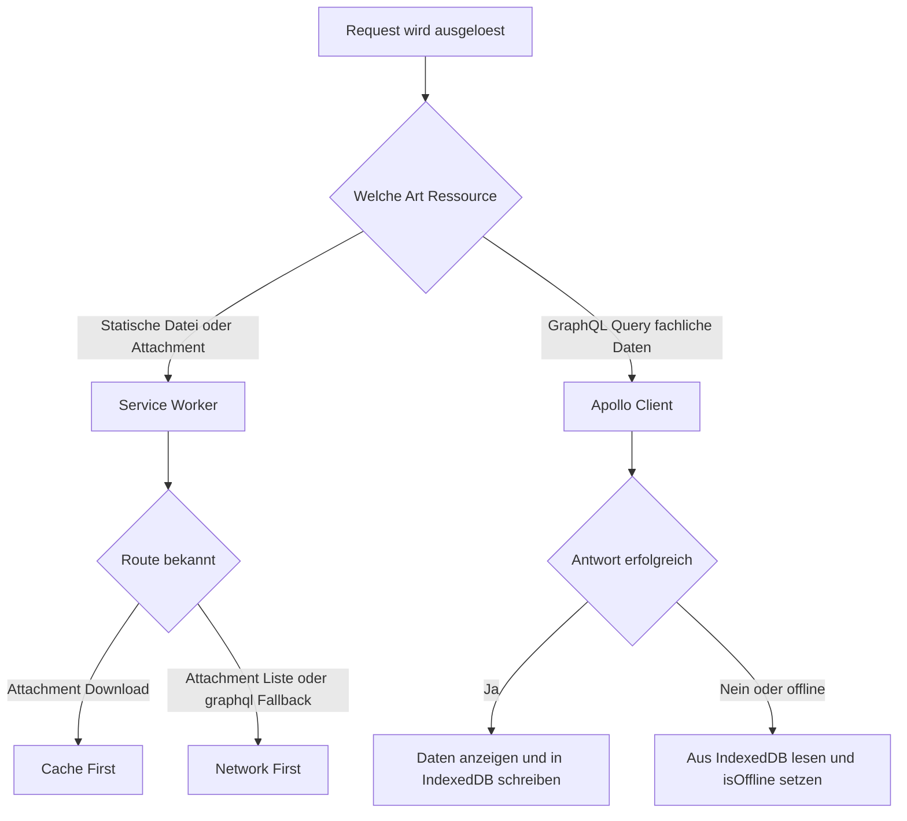

# Dokumentation: Cache- und Offline-Strategie

## 1. Grundprinzip

Die Anwendung unterscheidet zwei Arten von Inhalten, die unterschiedlich gecacht werden müssen, und setzt dafür bewusst zwei getrennte Mechanismen ein:

| Inhaltsart | Beispiele | Mechanismus |
| --- | --- | --- |
| Statische Assets, Datei-Anhänge, App-Shell | JS/CSS-Bundles, hochgeladene Bilder/Dateien | Service Worker (Workbox über `vite-plugin-pwa`) |
| Fachliche, strukturierte Daten | Lerngruppen, Karteikarten, Rangliste, Runs | Eigener IndexedDB-Layer |

Der Grund für die Trennung: Ein Service Worker cacht auf Basis von **URL und HTTP-Methode**. Der GraphQL-Endpunkt (`/graphql`) ist aber für praktisch alle fachlichen Daten derselbe Endpunkt (`POST /graphql`) — Workbox kann nicht anhand der URL unterscheiden, ob gerade Karteikarten oder eine Rangliste abgefragt wurden. Für inhaltlich unterscheidbare Offline-Verfügbarkeit war deshalb ein zusätzlicher, GraphQL-bewusster Layer nötig.

## 2. Service-Worker-Strategie (Workbox)

Konfiguriert in `vite.config.js` über `VitePWA`.

| Route | Strategie | Begründung |
| --- | --- | --- |
| `GET /api/v1/index-cards/*/attachments/:id` (Datei-Download) | Cache First | Einmal hochgeladene Dateien ändern sich nie. Ein Netzwerk-Request ist unnötig, sobald die Datei einmal geladen wurde — schnellerer Zugriff, weniger Bandbreite. |
| `GET /api/v1/index-cards/*/attachments` (Anhänge-Liste) | Network First | Die Liste kann sich jederzeit ändern (neuer Upload durch ein anderes Gruppenmitglied). Aktuelle Daten haben Vorrang, der Cache dient nur als Fallback. |
| `POST /graphql` | Network First, 5 Sekunden Timeout | Reiner Sicherheits-Fallback gegen Netzwerkfehler. Die eigentliche, inhaltlich differenzierte Offline-Fähigkeit für GraphQL-Daten läuft nicht hierüber, sondern über den IndexedDB-Layer (Abschnitt 3). |

Zusätzlich cacht Workbox automatisch die App-Shell (HTML, JS-, CSS-Bundles) beim ersten Besuch, sodass die Anwendung offline überhaupt startet.

`devOptions.enabled: true` sorgt dafür, dass Service Worker und Manifest bereits im Vite-Dev-Server aktiv sind — ohne diese Option würde der Service Worker sonst erst im Produktions-Build (`vite build && vite preview`) injiziert, was das Testen der Offline-Fähigkeit während der Entwicklung erschwert hätte.

## 3. IndexedDB-Layer für fachliche Daten

Eigene Datenbank `webtech-offline`, verwaltet über `offlineStorage.service.js`.

### 3.1 Object Stores

| Store | Key | Index | Befüllt durch |
| --- | --- | --- | --- |
| `study_groups` | `id` | – | `offlineCacheLink` (automatisch, bei jeder `getMyStudyGroups`/`getStudyGroup`-Query) |
| `indexcards` | `id` | `study_group_id` | `offlineCacheLink` (automatisch, bei `getIndexCards`) |
| `rankings` | `studyGroupId` | – | `offlineCacheLink` (automatisch, bei `getRanking`) |
| `runs` | `id` | `study_group_id` | `offlineCacheLink` (automatisch, bei `getRuns`, mit Transformation der verschachtelten Gruppen-ID, siehe Abschnitt 3.2) |
| `messages` | `id` | `chat_id` | Direkt durch die Chat-Web-Component (`ChatWindowElement.js`), da diese außerhalb von Apollo läuft |

### 3.2 Automatisches Schreiben: `offlineCacheLink`

Ein zentraler Apollo Link fängt jede erfolgreiche GraphQL-Response ab und schreibt relevante Felder automatisch in den passenden Store — Views müssen sich um das Caching nicht selbst kümmern:

```js
if (data.getRuns) {
  const runsWithFlatGroupId = data.getRuns.map((run) => ({
    ...run,
    studyGroupId: run.studyGroup?.id,
  }))
  cacheRuns(runsWithFlatGroupId)
}
```

Diese Transformation war notwendig, weil `getRuns` die Lerngruppe verschachtelt zurückliefert (`run.studyGroup.id`), IndexedDB-Indizes aber nur auf flache Felder des gespeicherten Objekts zugreifen können. Ohne den Zwischenschritt wären Runs zwar gespeichert, aber über den Index nie wieder auffindbar gewesen.

### 3.3 Lesender Zugriff: `useOfflineAwareQuery`

Ein Composable kapselt den Umschalt-Mechanismus zwischen Live-Daten und Cache, damit ihn nicht jede View einzeln nachbauen muss:

1. Query läuft normal über Apollo.
2. Antwort erfolgreich → Daten werden übernommen, `isOffline = false`.
3. Anfrage schlägt fehl **oder** `navigator.onLine` wird `false` → es wird aus IndexedDB nachgeladen, `isOffline = true`.

Views erhalten so neben den Daten auch einen `isOffline`-Flag, um dem Nutzer sichtbar zu machen, dass er gerade auf veralteten Daten arbeitet.

## 4. Umgang mit Schreibaktionen im Offline-Fall

Bewusste Design-Entscheidung: **Kein Offline-Queueing von Schreibaktionen.** Aktionen, die zwingend einen Server-Request brauchen — eine Gruppe erstellen oder beitreten, einen Run starten, eine Chat-Nachricht senden — werden im Frontend erkannt und blockiert, statt eine Aktion zuzulassen, die ohnehin fehlschlagen würde oder client-seitig einen inkonsistenten Zwischenzustand erzeugen könnte (z. B. ein Run, der lokal "gestartet" scheint, aber serverseitig nie existiert). Der Nutzer bekommt stattdessen einen erklärenden Hinweistext.

Diese Grenze ist bewusst gezogen und nicht als fehlende Funktionalität zu verstehen: Ein echtes Offline-Queueing (Aktionen lokal speichern und bei Rückkehr der Verbindung automatisch nachsenden) hätte zusätzliche Konfliktbehandlung nötig gemacht — zum Beispiel, wenn zwei Nutzer offline gleichzeitig dieselbe Karteikarte bearbeitet hätten. Für den Scope dieser Abgabe wurde das bewusst nicht umgesetzt.

## 5. Scope-Grenze der Offline-Verfügbarkeit

Offline abrufbar sind ausschließlich Daten, die **zuvor mindestens einmal online geladen wurden**. Eine neue, noch nie besuchte Lerngruppe kann naturgemäß nicht offline zum ersten Mal geladen werden, da schlicht keine Daten dafür im Cache existieren. Das betrifft alle Stores gleichermaßen (Lerngruppen, Karteikarten, Rangliste, Runs, Nachrichten).

## 6. Diagramm: Entscheidung, welcher Cache greift



## 7. Bekannte Einschränkungen

- Live über WebSocket empfangene Chat-Nachrichten werden nicht zusätzlich in IndexedDB gespiegelt, nur die beim Laden der Historie abgerufenen.
- Kein Offline-Queueing für Schreibaktionen (siehe Abschnitt 4) — bewusste Scope-Entscheidung, keine offene Baustelle.
- Offline-Verfügbarkeit ist strikt auf bereits online besuchte Inhalte beschränkt (siehe Abschnitt 5).
