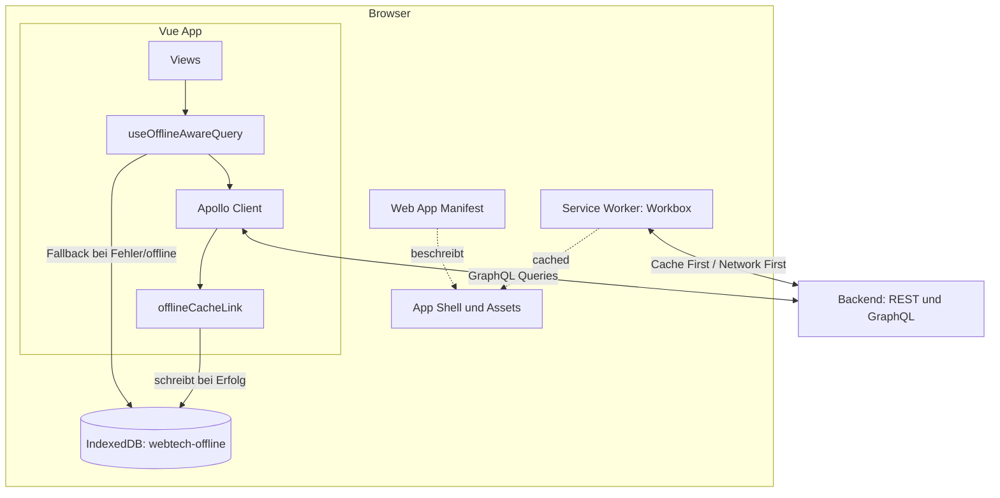
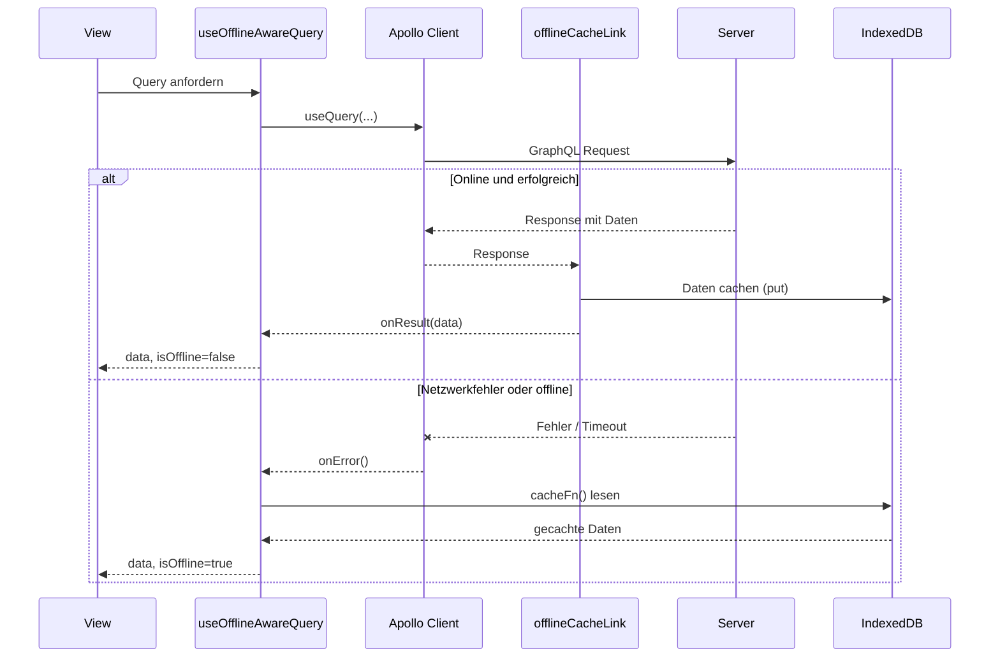

# Technische Dokumentation: PWA & Offline-Strategie

## 1. Überblick

Die Anwendung ist als installierbare Progressive Web App umgesetzt. Dafür kommen drei Bausteine zusammen, die unterschiedliche Aufgaben übernehmen:

| Baustein | Werkzeug | Zuständig für |
| --- | --- | --- |
| Service Worker + Manifest | `vite-plugin-pwa` (Workbox) | App-Shell-Caching, Installierbarkeit, statische Assets & Attachments |
| GraphQL-Offline-Cache | Eigener Apollo Link + IndexedDB | Fachliche Daten (Lerngruppen, Karteikarten, Rangliste, Runs) |
| Query-Fallback | `useOfflineAwareQuery` Composable | Automatisches Umschalten zwischen Live-Daten und Cache |

Der Grund für diese Zweiteilung: Workbox cacht auf Basis von URL und HTTP-Methode. Der GraphQL-Endpunkt (`/graphql`) ist aber für alle Queries derselbe Endpunkt (POST). Workbox kann also nicht zwischen "Karteikarten abfragen" und "Rangliste abfragen" unterscheiden. Für strukturierte, fachliche Offline-Daten wurde deshalb ein eigener Layer auf Basis von IndexedDB gebaut.

## 2. Service Worker & Manifest

Datei: `vite.config.js`

Konfiguriert über `VitePWA` mit `registerType: 'autoUpdate'` (Service Worker aktualisiert sich automatisch im Hintergrund) und `devOptions.enabled: true`, damit Manifest und Service Worker bereits im Dev-Server (`npm run dev`) aktiv sind.

**Web App Manifest:**

- Name: „Dungeon of Knowledge", `display: standalone`
- Icons in 192px und 512px, zusätzlich eine 512px-Variante mit `purpose: 'maskable'` für adaptive Icons auf Android

**Cache-Strategien (`runtimeCaching`):**

| Route | Strategie | Begründung |
| --- | --- | --- |
| `GET /api/v1/index-cards/*/attachments/:id` (Datei-Download) | Cache First | Einmal hochgeladene Dateien ändern sich nie. Netzwerk-Request ist unnötig, sobald gecacht |
| `GET /api/v1/index-cards/*/attachments` (Anhänge-Liste) | Network First | Liste kann sich ändern (neue Uploads)aktuelle Daten haben Vorrang |
| `POST /graphql` | Network First, 5s Timeout | Fallback nur für den Fall eines Netzwerkfehlers; eigentliche Offline-Fähigkeit läuft über den IndexedDB-Layer, s. Abschnitt 3 |

## 3. GraphQL-Offline-Cache

Dateien: `offlineCacheLink.js`, `offlineStorage.service.js`

`offlineCacheLink` ist ein Apollo Link, der zwischen jede erfolgreiche Response gehängt wird. Er inspiziert die zurückgegebenen Felder und schreibt sie automatisch in IndexedDB:

- `getMyStudyGroups` → `cacheStudyGroups()`
- `getStudyGroup` → `patchStudyGroupMembers()` (die Query liefert keine Gruppen-ID mit zurück, deshalb wird sie aus den Operation-Variablen entnommen und die bestehende Gruppe um `members` ergänzt statt überschrieben)
- `getIndexCards` → `cacheIndexCards()`
- `getRanking` → `cacheRanking()`
- `getRuns` → `cacheRuns()`, mit vorheriger Transformation (siehe unten)

**Sonderfall Runs: verschachtelte vs. flache Gruppen-ID**

`getRuns` liefert die Lerngruppe verschachtelt zurück (`run.studyGroup.id`), da das GraphQL-Schema die Beziehung so modelliert. Der IndexedDB-Index `study_group_id` auf dem `runs`-Store erwartet dagegen ein flaches Feld `studyGroupId` auf dem Objekt selbst, da IndexedDB-Indizes nicht direkt auf verschachtelte Pfade zugreifen können, ohne dass der Index explizit mit `keyPath: 'studyGroup.id'` angelegt wurde. Ursprünglich fehlte diese Umwandlung: Runs wurden zwar gespeichert, aber der Index fand beim Lesen nie einen Treffer, da `studyGroupId` schlicht `undefined` war.

Fix in `offlineCacheLink.js`:

```js
if (data.getRuns) {
  const runsWithFlatGroupId = data.getRuns.map((run) => ({
    ...run,
    studyGroupId: run.studyGroup?.id,
  }))
  cacheRuns(runsWithFlatGroupId)
}
```

**IndexedDB-Datenbank** `webtech-offline` (Version 1) mit den Object Stores:

| Store | Key | Index | Inhalt |
| --- | --- | --- | --- |
| `study_groups` | `id` | – | Gruppen-Metadaten inkl. nachträglich gepatchter `members` |
| `indexcards` | `id` | `study_group_id` | Karteikarten je Lerngruppe |
| `messages` | `id` | `chat_id` | Chat-Nachrichten |
| `runs` | `id` | `study_group_id` | Run-Historie, indiziert über die beim Cachen ergänzte flache `studyGroupId` |
| `rankings` | `studyGroupId` | – | Rangliste als komplettes Array pro Gruppe |

> Hinweis: Die `messages`-Cache-Funktionen (`cacheMessages`, `getCachedMessages`) existieren im Service, werden aber nicht über `offlineCacheLink` befüllt. Die Chat-Nachrichten laufen über die Web Component mit eigenem `fetch()`, nicht über Apollo (siehe Abschnitt 7).

## 4. Query-Fallback

Datei: `useOfflineAwareQuery.js`

Composable, das eine normale Apollo-Query kapselt und bei Bedarf transparent auf den Cache umschaltet:

1. Startet die Apollo-Query ganz normal über `useQuery`.
2. Kommt eine Antwort (`onResult`), werden Daten aus `res.data[dataKey]` übernommen und `isOffline` auf `false` gesetzt.
3. Schlägt die Query fehl (`onError`), lädt `loadFromCache()` stattdessen aus IndexedDB über die übergebene `cacheFn`.
4. Ein `watch` auf `navigator.onLine` löst beim Wechsel in den Offline-Zustand ebenfalls sofort `loadFromCache()` aus, unabhängig vom Query-Ergebnis.

Views erhalten `{ data, loading, isOffline, error, refetch }` und können so zum Beispiel einen Offline-Hinweis anzeigen.

**Beispiel: `RunHistoryView.vue`**

```js
const { data: runsData, loading, error } = useOfflineAwareQuery(
  GET_RUNS,
  () => ({}),
  () => ({}),
  {
    dataKey: 'getRuns',
    cacheFn: () => getCachedRuns(props.studyGroupId),
  },
)

const runs = computed(() =>
  (runsData.value ?? []).filter((run) => run.studyGroup?.id === props.studyGroupId),
)
```

Die `GET_RUNS`-Query liefert die Runs des eingeloggten Users gruppenübergreifend zurück, ohne `studyGroupId`-Parameter. Die View filtert deshalb zusätzlich client-seitig per `computed` auf die aktuell angezeigte Lerngruppe. Das greift sowohl im Online-Fall (Live-Daten) als auch im Offline-Fall, auch wenn die Daten dort bereits über `getCachedRuns` vorgefiltert ankommen.

**Scope-Grenze:** Offline verfügbar sind nur bereits online besuchte Lerngruppen. Eine neue Gruppe kann nicht offline zum ersten Mal geladen werden.

## 5. Diagramm: Aufbau



## 6. Diagramm: Laufzeitverhalten einer Query (online vs. offline)



## 7. Bekannte Einschränkungen

- Kein Offline-Support beim ersten Besuch einer Lerngruppe.
- Schreibaktionen wie Gruppe beitreten oder erstellen, Run starten, Nachricht senden sind offline blockiert, nicht offline-fähig gepuffert.
- Chat-Nachrichten sind im `offlineStorage.service.js` mit `cacheMessages`/`getCachedMessages` vorbereitet, laufen aber über die Chat-Web-Component mit eigenem `fetch()` statt über Apollo, weshalb `offlineCacheLink` sie nicht automatisch abfängt. Die Web Component müsste den Service direkt anbinden, um Nachrichten offline verfügbar zu machen.