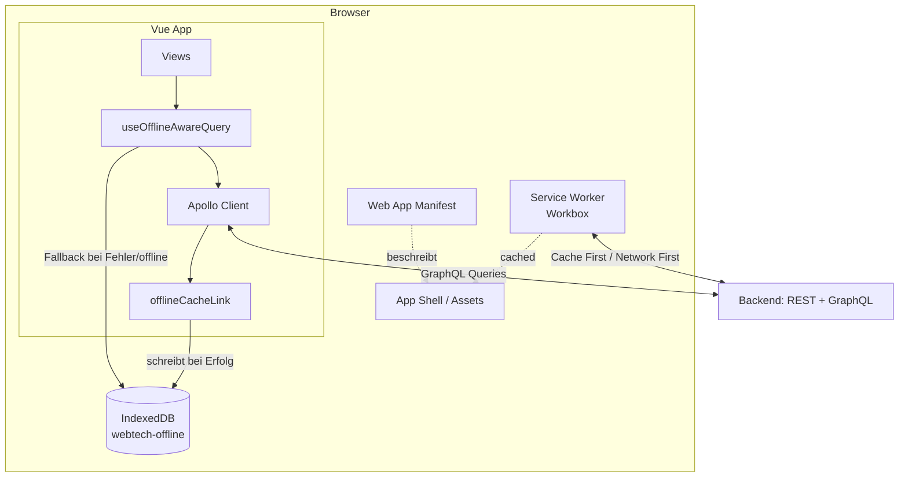
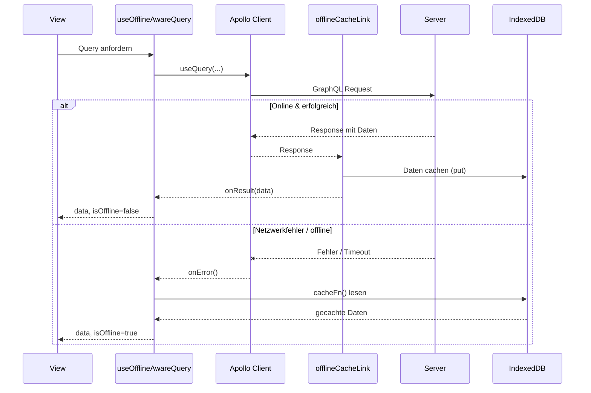

# Technische Dokumentation: PWA & Offline-Strategie

## 1. Überblick

Die Anwendung ist als installierbare Progressive Web App umgesetzt. Dafür kommen drei Bausteine zusammen, die unterschiedliche Aufgaben übernehmen:

| Baustein | Werkzeug | Zuständig für |
|---|---|---|
| Service Worker + Manifest | `vite-plugin-pwa` (Workbox) | App-Shell-Caching, Installierbarkeit, statische Assets & Attachments |
| GraphQL-Offline-Cache | Eigener Apollo Link + IndexedDB | Fachliche Daten (Lerngruppen, Karteikarten, Rangliste) |
| Query-Fallback | `useOfflineAwareQuery` Composable | Automatisches Umschalten zwischen Live-Daten und Cache |

Der Grund für diese Zweiteilung: Workbox cacht auf Basis von URL/HTTP-Methode. Der GraphQL-Endpunkt (`/graphql`) ist aber für alle Queries derselbe Endpunkt (POST) – Workbox kann also nicht zwischen "Karteikarten abfragen" und "Rangliste abfragen" unterscheiden. Für strukturierte, fachliche Offline-Daten wurde deshalb ein eigener Layer auf Basis von IndexedDB gebaut.

## 2. Service Worker & Manifest (`vite.config.js`)

Konfiguriert über `VitePWA` mit `registerType: 'autoUpdate'` (Service Worker aktualisiert sich automatisch im Hintergrund) und `devOptions.enabled: true`, damit Manifest und Service Worker bereits im Dev-Server (`npm run dev`) aktiv sind.

**Web App Manifest:**
- Name: „Dungeon of Knowledge", `display: standalone`
- Icons in 192px und 512px, zusätzlich eine 512px-Variante mit `purpose: 'maskable'` für adaptive Icons auf Android

**Cache-Strategien (`runtimeCaching`):**

| Route | Strategie | Begründung |
|---|---|---|
| `GET /api/v1/index-cards/*/attachments/:id` (Datei-Download) | Cache First | Einmal hochgeladene Dateien ändern sich nie – Netzwerk-Request ist unnötig, sobald gecacht |
| `GET /api/v1/index-cards/*/attachments` (Anhänge-Liste) | Network First | Liste kann sich ändern (neue Uploads) – aktuelle Daten haben Vorrang |
| `POST /graphql` | Network First, 5s Timeout | Fallback nur für den Fall eines Netzwerkfehlers; eigentliche Offline-Fähigkeit läuft über den IndexedDB-Layer, s.u. |

## 3. GraphQL-Offline-Cache (`offlineCacheLink.js` + `offlineStorage.service.js`)

`offlineCacheLink` ist ein Apollo Link, der zwischen jede erfolgreiche Response gehängt wird. Er inspiziert die zurückgegebenen Felder und schreibt sie automatisch in IndexedDB:

- `getMyStudyGroups` → `cacheStudyGroups()`
- `getStudyGroup` → `patchStudyGroupMembers()` (die Query liefert keine Gruppen-ID mit zurück, deshalb wird sie aus den Operation-Variablen entnommen und die bestehende Gruppe um `members` ergänzt statt überschrieben)
- `getIndexCards` → `cacheIndexCards()`
- `getRanking` → `cacheRanking()`

**IndexedDB-Datenbank** `webtech-offline` (Version 1) mit den Object Stores:

| Store | Key | Index | Inhalt |
|---|---|---|---|
| `study_groups` | `id` | – | Gruppen-Metadaten inkl. nachträglich gepatchter `members` |
| `indexcards` | `id` | `study_group_id` | Karteikarten je Lerngruppe |
| `messages` | `id` | `chat_id` | Chat-Nachrichten |
| `runs` | `id` | `study_group_id` | Run-Historie (Store vorhanden, Anbindung an Link noch offen) |
| `rankings` | `studyGroupId` | – | Rangliste als komplettes Array pro Gruppe |

> Hinweis für die Doku: `messages` und `runs` haben zwar bereits Cache-Funktionen (`cacheMessages`, `cacheRuns`) im Service, werden aber aktuell nicht automatisch über `offlineCacheLink` befüllt – die Chat-Nachrichten laufen über die Web Component (eigener `fetch`, kein Apollo), Runs sind laut Projektstand noch nicht angebunden.

## 4. Query-Fallback (`useOfflineAwareQuery.js`)

Composable, das eine normale Apollo-Query kapselt und bei Bedarf transparent auf den Cache umschaltet:

1. Startet die Apollo-Query ganz normal über `useQuery`.
2. Kommt eine Antwort (`onResult`) → Daten werden aus `res.data[dataKey]` übernommen, `isOffline = false`.
3. Schlägt die Query fehl (`onError`) → `loadFromCache()` lädt stattdessen aus IndexedDB über die übergebene `cacheFn`.
4. Ein `watch` auf `navigator.onLine` löst beim Wechsel in den Offline-Zustand ebenfalls sofort `loadFromCache()` aus, unabhängig vom Query-Ergebnis.

Views erhalten `{ data, loading, isOffline, error, refetch }` und können so z. B. einen Offline-Hinweis anzeigen.

**Scope-Grenze:** Offline verfügbar sind nur bereits online besuchte Lerngruppen – eine neue Gruppe kann nicht offline zum ersten Mal geladen werden.

## 5. Diagramm: Aufbau

## 6. Diagramm: Laufzeitverhalten einer Query (online vs. offline)

## 7. Bekannte Einschränkungen

- Kein Offline-Support beim ersten Besuch einer Lerngruppe.
- Schreibaktionen (Gruppe beitreten/erstellen, Run starten, Nachricht senden) sind offline blockiert, nicht offline-fähig gepuffert.
- `runs` und `messages` sind im Storage-Service vorbereitet, aber nicht vollständig an den automatischen Cache-Link angebunden.
