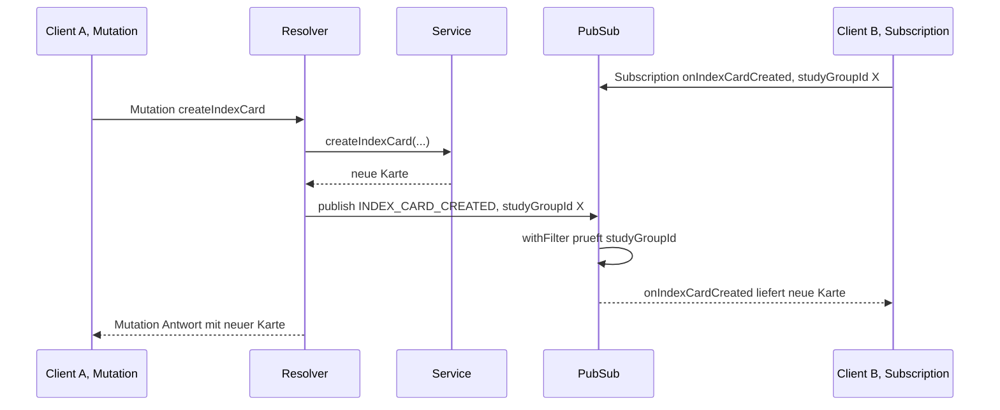
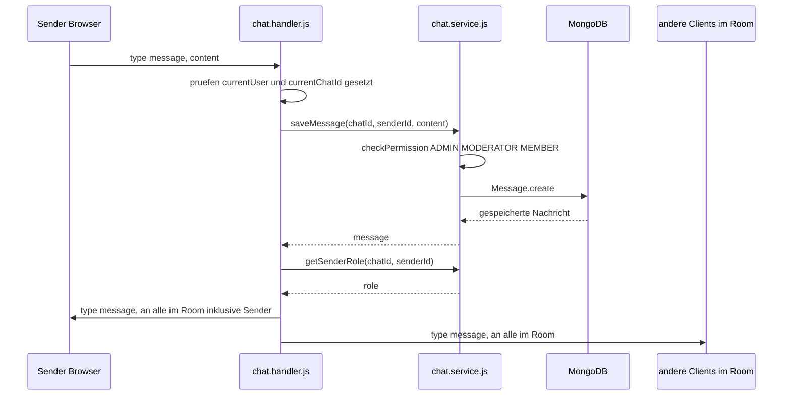

# Technische Dokumentation: Realtime- und Chat-Architektur

## 1. Überblick

Die Anwendung hat zwei unabhängige Echtzeit-Mechanismen, die bewusst getrennt sind (Begründung siehe Abschnitt 4):

| Mechanismus | Transport | Zweck |
| --- | --- | --- |
| GraphQL Subscriptions | `graphql-ws` über WebSocket (`/graphql`) | Live-Updates auf strukturierten, im Schema typisierten Daten (Karteikarten, Mitglieder, Rangliste, Run-Status) |
| Roher WebSocket-Chat | Eigenes Protokoll über WebSocket (`/chat`) | Senden, Empfangen und Löschen von Chat-Nachrichten in Echtzeit |

Beide laufen über denselben `httpServer`, aber über zwei getrennte `WebSocketServer`-Instanzen, die per `upgrade`-Event anhand des URL-Pfads unterschieden werden (siehe Architektur-Dokumentation, Abschnitt 1.3, zum `ws`-Library-Bug, der das nötig gemacht hat).

## 2. GraphQL Subscriptions

### 2.1 PubSub als zentrale Vermittlungsstelle

```js
// pubsub.js
import { PubSub } from 'graphql-subscriptions'
export const pubsub = new PubSub()
```

Eine einzige, im Prozess gehaltene `PubSub`-Instanz aus dem Paket `graphql-subscriptions`. Mutations publizieren Events in diese Instanz, Subscriptions abonnieren sie wieder heraus. Das Prinzip ist in allen Resolvern identisch:

1. Eine Mutation ändert Daten und ruft danach `pubsub.publish(EVENT_NAME, payload)` auf.
2. Eine Subscription abonniert dasselbe `EVENT_NAME` über `pubsub.asyncIterableIterator([EVENT_NAME])`.
3. `withFilter` sorgt dafür, dass ein Client nur Events empfängt, die zu den von ihm übergebenen Variablen passen (z. B. nur Updates der eigenen `studyGroupId`).

### 2.2 Muster an zwei Beispielen

**Ohne zusätzliches Argument im Payload** (`onRunUpdated`, gefiltert direkt über die ID im Payload):

```js
Subscription: {
  onRunUpdated: {
    subscribe: withFilter(
      () => pubsub.asyncIterableIterator([RUN_UPDATED]),
      (payload, variables) => payload.onRunUpdated.id === variables.runId,
    ),
    resolve: (payload) => payload.onRunUpdated,
  },
},
```

**Mit separatem Filter-Feld im Payload** (`onIndexCardCreated`, `studyGroupId` wird getrennt vom eigentlichen Rückgabewert mitgeschickt):

```js
Subscription: {
  onIndexCardCreated: {
    subscribe: withFilter(
      () => pubsub.asyncIterableIterator([INDEX_CARD_CREATED]),
      (payload, variables) => payload.studyGroupId === variables.studyGroupId,
    ),
    resolve: (payload) => payload.onIndexCardCreated,
  },
},
```

Beide Varianten sind funktional gleichwertig. Der Unterschied liegt nur darin, ob das Filterkriterium (`studyGroupId`) Teil des zurückgegebenen Objekts ist (`Run.id`) oder separat mitgeschickt werden muss, weil es im Rückgabetyp selbst nicht vorkommt (`IndexCard` hat kein Top-Level-Feld, das der Subscription-Variable `studyGroupId` 1:1 entspricht. `studyGroupId` existiert zwar auf `IndexCard`, wird hier aber unabhängig vom eigentlichen Rückgabewert übergeben, um den Filter unabhängig vom Resolve-Ergebnis zu halten).

### 2.3 Alle Events im Überblick

| Subscription | Payload-Feld für Filter | Publiziert von |
| --- | --- | --- |
| `onRunUpdated(runId)` | `payload.onRunUpdated.id` | vermutlich `run.service.js` (Konvention: `RUN_UPDATED`) |
| `onIndexCardCreated(studyGroupId)` | `payload.studyGroupId` | `createIndexCard` in `indexCard.resolver.js` |
| `onIndexCardUpdated(studyGroupId)` | `payload.studyGroupId` | `updateIndexCard` in `indexCard.resolver.js` |
| `onIndexCardDeleted(studyGroupId)` | `payload.studyGroupId` | `deleteIndexCard` in `indexCard.resolver.js` |
| `onMembersUpdated(studyGroupId)` | `payload.studyGroupId` | `joinStudyGroup`, `leaveStudyGroup`, `removeMember`, `updateMembershipRole` in `studyGroup.service.js` |
| `onStudyGroupDeleted` | kein Filter (globaler Kanal) | `leaveStudyGroup`, wenn das letzte Mitglied die Gruppe verlässt |
| `onRankingUpdated(studyGroupId)` | `payload.studyGroupId` | `endRun` in `run.service.js`, nach jedem abgeschlossenen Run |

`onStudyGroupDeleted` hat als einzige Subscription keinen `withFilter`, sie liefert die gelöschte `studyGroupId` an alle Abonnenten gleichermaßen, da typischerweise alle Clients mit offenem Gruppen-Suchfenster benachrichtigt werden sollen, nicht nur Mitglieder der gelöschten Gruppe.

### 2.4 Sequenzdiagramm: Von der Mutation zum Live-Update



## 3. Chat: eigenes WebSocket-Protokoll

### 3.1 Nachrichtenformat

Ein eigenes, schlankes JSON-Protokoll statt GraphQL, mit vier Typen:

```json
{ "type": "join",    "token": "...", "chatId": "..." }
{ "type": "message", "content": "..." }
{ "type": "delete",  "messageId": "..." }
{ "type": "error",   "message": "..." }
```

`join` muss als erste Nachricht gesendet werden, da `chat.handler.js` `currentUser`/`currentChatId` erst danach setzt und `message`/`delete` ohne diesen Zustand ablehnt (siehe Schutz-der-Schnittstellen-Dokumentation, Abschnitt 4).

### 3.2 Server-seitige Verwaltung: `chatRooms`

```js
const chatRooms = new Map() // chatId → Set von WebSocket-Clients
```

Eine einzige, im Prozessspeicher gehaltene `Map`, die jede `chatId` auf die Menge aktuell verbundener WebSocket-Clients abbildet. Beim Senden einer Nachricht wird an alle Clients im Set geschickt:

```js
for (const client of chatRooms.get(currentChatId)) {
  client.send(payload)
}
```

Bei Verbindungsabbruch (`ws.on('close', ...)`) wird der Client aus dem Set seiner `chatId` entfernt.

### 3.3 Persistenz vs. Echtzeit

`saveMessage()` schreibt jede Nachricht sofort in MongoDB (`messages`-Collection, siehe `message.model.js`), **bevor** sie an die verbundenen Clients gebroadcastet wird:

```js
export async function saveMessage(chatId, senderId, content) {
  const studyGroup = await findByChatId(chatId)
  if (!studyGroup) throw new Error('Lerngruppe nicht gefunden')
  await checkPermission(senderId, studyGroup.id, ['ADMIN', 'MODERATOR', 'MEMBER'])
  return await Message.create({ chat_id: chatId, sender_id: senderId, content })
}
```

Das Mongoose-Schema nutzt die eingebaute Timestamp-Option, um `sent_at` automatisch zu setzen:

```js
{ timestamps: { createdAt: 'sent_at', updatedAt: false } }
```

Damit ist jede live gesendete Nachricht auch sofort über die historische GraphQL-Query `getMessages` (mit `before`-Cursor-Pagination auf Basis von `sent_at`) abrufbar. Es gibt keinen Zustand, in dem eine Nachricht nur im WebSocket-Broadcast existiert, aber noch nicht in der Datenbank steht.

### 3.4 Sequenzdiagramm: Nachricht senden und empfangen



### 3.5 `senderRole` zur Laufzeit ergänzt

Weder das Mongoose-Schema noch die WebSocket-Nachricht selbst enthalten die Rolle des Senders dauerhaft, sie wird bei jedem Broadcast frisch über `getSenderRole(chatId, senderId)` nachgeschlagen und dem Payload hinzugefügt:

```js
const senderRole = await getSenderRole(currentChatId, currentUser.userId)
```

Das ist bewusst so gelöst, da sich die Rolle eines Mitglieds ändern kann (z. B. durch `updateMembershipRole`), ohne dass alte, in der DB gespeicherte Nachrichten rückwirkend angepasst werden müssten. Die Rolle wird nicht mit der Nachricht persistiert, sondern immer aktuell zum Anzeigezeitpunkt aufgelöst. Derselbe Mechanismus greift auch beim historischen Laden über GraphQL: Der `Message.senderRole`-Feldresolver in `chat.resolver.js` ruft ebenfalls `ChatService.getSenderRole()` live auf.

## 4. Warum zwei getrennte Realtime-Mechanismen statt einem

Diese Frage ist explizit Teil der geforderten Reflexion ("Welche Anforderungen ließen sich mit WebSockets jeweils besonders gut oder weniger gut abbilden?"). Kurz zusammengefasst:

- **Historisch gewachsen**: Der Chat wurde zuerst als eigenständiges WebSocket-Feature gebaut, bevor der Rest der Anwendung auf GraphQL vereinheitlicht wurde.
- **Kein GraphQL-Mehrwert für den Chat selbst**: `sendMessage`-Mutation und `onNewMessage`-Subscription wurden versucht, aber nie vom Frontend genutzt und wieder entfernt, um kein totes Schema zu hinterlassen (siehe Architektur-Dokumentation, Abschnitt 3.2).
- **Historisches Laden bleibt GraphQL**: `getMessages` ist nicht latenzkritisch und profitiert von der ohnehin vorhandenen GraphQL-Infrastruktur (Pagination, Typisierung) — nur der Echtzeit-Anteil (senden/empfangen) blieb beim rohen WebSocket.

## 5. Bekannte Einschränkungen

- **In-Memory PubSub, nicht horizontal skalierbar**: `new PubSub()` aus `graphql-subscriptions` hält alle Events ausschließlich im Speicher des einen Node-Prozesses. Bei mehreren Backend-Instanzen (z. B. hinter einem Load Balancer) würden Events, die auf Instanz A publiziert werden, nicht bei Clients ankommen, die ihre Subscription auf Instanz B offen haben. Für Produktionsbetrieb mit mehreren Instanzen wäre ein verteilter PubSub (z. B. Redis-basiert über `graphql-redis-subscriptions`) nötig. Für den Rahmen dieser Abgabe (eine Backend-Instanz) ist das unkritisch.
- **`chatRooms`-Map ebenfalls In-Memory**: Analoge Einschränkung für den Chat; bei mehreren Backend-Instanzen würden Nachrichten nur an Clients ausgeliefert, die zufällig mit derselben Instanz verbunden sind.
- **Keine Wiederherstellung offener Chat-Verbindungen nach Server-Neustart**: Verbindungen im `chatRooms`-Set gehen bei einem Neustart verloren; Clients müssen erneut `join` senden. Das übernimmt aktuell nicht automatisch die Web Component, sondern erfordert einen manuellen Reconnect (siehe Web-Components-Dokumentation zur `_connectionId`-Logik).
- **`join` ohne Mitgliedschaftsprüfung**: Siehe Schutz-der-Schnittstellen-Dokumentation, Abschnitt 6; betrifft nur passives Mitlesen, nicht Schreiben oder Löschen.
