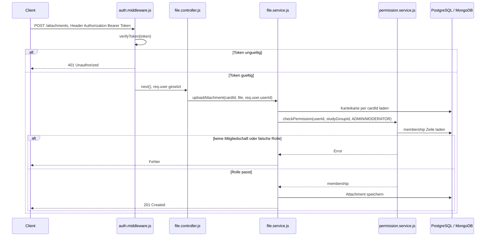
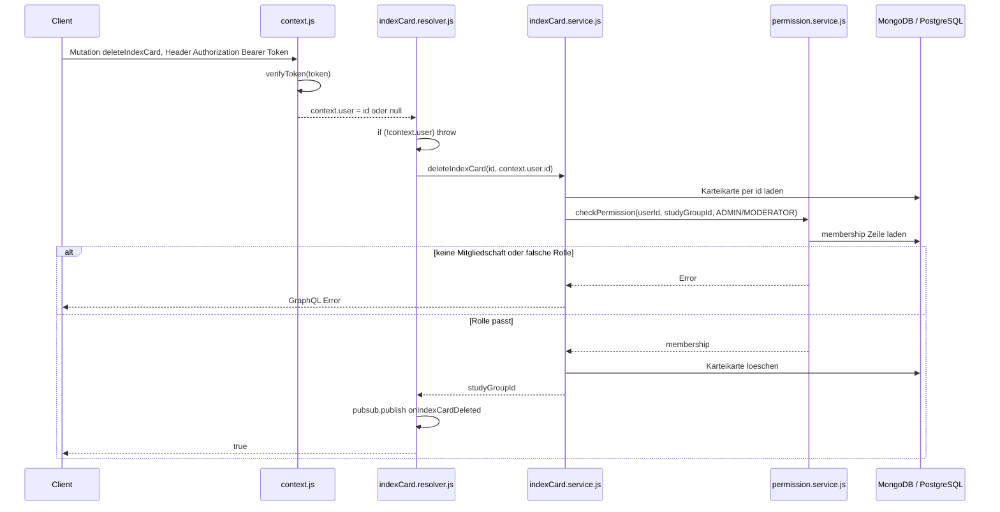
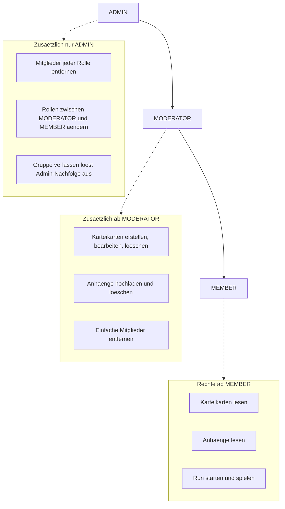

# Technische Dokumentation: Rollen- und Rechtekonzept

## 1. Überblick

Berechtigungen laufen in der Anwendung auf zwei unabhängigen Ebenen:

| Ebene | Frage | Technologie |
| --- | --- | --- |
| Authentifizierung | Wer ist der Nutzer? | JWT, ausgestellt nach Passkey- oder Google-OAuth-Login |
| Autorisierung | Darf dieser Nutzer diese Aktion in dieser Lerngruppe ausführen? | Rollen aus der `membership`-Tabelle, geprüft über `checkPermission()` |

Wichtig für das Verständnis der Architektur: Rollen sind **nicht global am User**, sondern **kontextabhängig pro Lerngruppe** in der `membership`-Zwischentabelle gespeichert. Derselbe User kann in Gruppe A `ADMIN` und in Gruppe B `MEMBER` sein.

```text
Rolle: ADMIN | MODERATOR | MEMBER
```

## 2. Authentifizierung: Vom Login zum JWT

### 2.1 Zwei Wege zum Token

Beide Login-Wege enden im selben `token.service.js`, das die Anwendung mit einem eigenen JWT versorgt — unabhängig davon, wie sich der Nutzer authentifiziert hat:

**Passkeys (WebAuthn)**, `passkey.service.js`:

1. `startRegistration()`/`startLogin()` erzeugen eine WebAuthn-Challenge und speichern sie mit Ablaufzeit (5 Minuten) in der `webauthn_challenge`-Tabelle.
2. `verifyRegistration()`/`verifyLogin()` verifizieren die kryptografische Signatur des Browsers gegen die gespeicherte Challenge bzw. den gespeicherten Public Key.
3. Bei erfolgreichem Login: `generateToken({ userId: passkey.userId })`.
4. Die Challenge wird nach einmaligem Verbrauch gelöscht (Replay-Schutz).

**Google OAuth**, `oauth.service.js`:

1. `handleGoogleCallback(code)` tauscht den Authorization Code gegen Google-Tokens und verifiziert das ID-Token.
2. User wird per `payload.sub` (Googles User-ID) gefunden oder neu angelegt — in einer Transaktion, um Race Conditions bei parallelen Erst-Logins zu vermeiden.
3. Es wird **nicht** direkt ein JWT ausgestellt, sondern zunächst ein kurzlebiger, einmal verwendbarer Auth-Code erzeugt (`authCode.service.js`, `createAuthCode(userId)`, 60 Sekunden gültig). Dieser Code wird per Redirect als Query-Parameter ans Frontend übergeben (`FRONTEND_URL/auth/callback?code=...`), **nicht** das JWT selbst.
4. Das Frontend tauscht den Code anschließend über `POST /auth/exchange` gegen das eigentliche JWT ein (`consumeAuthCode(code)` → `generateToken({ userId })`). Der Code wird dabei sofort invalidiert (Einmalgebrauch, Replay-Schutz), unabhängig vom Erfolg des Aufrufs.

Diese Zwischenstufe verhindert, dass das JWT selbst in der Redirect-URL landet und damit in Browser-History, Server-Logs oder Referrer-Headern sichtbar wird. Nur der kurzlebige, einmal nutzbare Code durchläuft die URL.

### 2.2 Token-Erzeugung und -Prüfung (`token.service.js`)

```js
function generateToken(payload) {
  return jwt.sign(payload, JWT_SECRET, { expiresIn: env.JWT_EXPIRES_IN })
}

function verifyToken(token) {
  return jwt.verify(token, JWT_SECRET)
}
```

Payload enthält minimal `{ userId }`. Bewusst schlank gehalten: Rollen stehen **nicht** im Token, da sie sich pro Lerngruppe unterscheiden und sich außerdem ändern können, ohne dass ein neues Token ausgestellt wird (siehe Abschnitt 4). Das Token dient ausschließlich der Identifizierung, nicht der Autorisierung.

## 3. Wie Rolle und Identität in einen Request gelangen

Beide Schnittstellen (REST und GraphQL) verifizieren denselben JWT über dieselbe Funktion, aber auf unterschiedliche Weise gebunden.

### 3.1 REST: `auth.middleware.js`

```js
export function authMiddleware(req, res, next) {
  const authHeader = req.headers.authorization
  if (!authHeader || !authHeader.startsWith('Bearer ')) {
    return res.status(401).json({ error: 'Unauthorized', message: 'Kein gültiger Token' })
  }
  const token = authHeader.slice(BEARER_PREFIX_LENGTH)
  try {
    const payload = verifyToken(token)
    req.user = payload
    next()
  } catch {
    return res.status(401).json({ error: 'Unauthorized', message: 'Kein gültiger Token' })
  }
}
```

Als Express-Middleware vor geschützte Routen gehängt. Bei Erfolg landet die decodierte Payload (`{ userId, iat, exp }`) unter `req.user`, auf die nachfolgende Controller zugreifen.

> Hinweis: Es gibt keine eigene rollenprüfende Express-Middleware. Rollenprüfung findet stattdessen einheitlich in der Service-Schicht statt (siehe Abschnitt 4), nicht auf Middleware-Ebene. Das ist bewusst konsistent mit dem GraphQL-Teil, wo es aus denselben Gründen ebenfalls keine separate Rollen-Prüfschicht vor den Resolvern gibt.

### 3.2 GraphQL: `context.js`

```js
export async function createContext({ req, token: directToken } = {}) {
  const authHeader = req?.headers?.authorization
  const token = directToken ?? (authHeader?.startsWith('Bearer ') ? authHeader.split(' ')[1] : null)
  if (!token) return { user: null }

  const payload = verifyToken(token)
  return { user: { id: payload.userId } }
}
```

Wird bei jedem GraphQL-Request (Query, Mutation, Subscription) von Apollo Server aufgerufen und liefert den `context`, den alle Resolver als drittes Argument erhalten. Anders als bei REST gibt es hier keinen harten Abbruch bei fehlendem Token — `context.user` ist dann einfach `null`, und jeder Resolver prüft das selbst:

```js
getMyStudyGroups: async (_, __, context) => {
  if (!context.user) throw new Error("Nicht authentifiziert")
  return StudyGroupService.getMyStudyGroups(context.user.id)
}
```

Das ist notwendig, weil GraphQL alle Operationen über einen einzigen Endpunkt (`POST /graphql`) abwickelt — ein globaler 401 auf HTTP-Ebene wie bei REST würde auch öffentlich zugängliche Queries blockieren. Die Prüfung wandert deshalb in jeden einzelnen Resolver.

## 4. Autorisierung: `checkPermission()`

Herzstück des Rechtekonzepts ist eine einzige, zentrale Funktion in `permission.service.js`, die von REST-Services und GraphQL-Services gleichermaßen genutzt wird:

```js
export async function checkPermission(userId, studyGroupId, requiredRoles) {
  const membership = await findOne(userId, studyGroupId)
  if (!membership) {
    throw new Error('Nicht Mitglied dieser Lerngruppe')
  }
  if (!requiredRoles.includes(membership.role)) {
    throw new Error('Keine Berechtigung mit dieser Rolle')
  }
  return membership
}
```

Ablauf:

1. Mitgliedschaft des Users in der jeweiligen Lerngruppe wird per SQL-Lookup (`membership`-Tabelle, zusammengesetzter Schlüssel `user_id` + `study_group_id`) geholt.
2. Existiert keine Mitgliedschaft, wird abgebrochen — wer nicht in der Gruppe ist, hat unabhängig von der Rolle keinen Zugriff.
3. Die Rolle der Mitgliedschaft wird gegen eine vom Aufrufer übergebene Liste erlaubter Rollen geprüft.
4. Bei Erfolg wird die **gesamte Mitgliedschaft zurückgegeben**, nicht nur `true`/`false` — das erlaubt Aufrufern, die eigene Rolle direkt weiterzuverwenden, ohne einen zweiten Datenbank-Request zu brauchen (siehe `removeMember`/`updateMembershipRole` unten).

Diese eine Funktion wird konsequent aus allen Service-Schichten heraus aufgerufen — REST (`file.service.js`) genauso wie GraphQL (`studyGroup.service.js`, `indexCard.service.js`, `run.service.js`). Dadurch ist Autorisierung an einer einzigen Stelle im Code gebündelt, unabhängig davon, über welche Schnittstelle der Request kam.

### 4.1 Rollen-Anforderungen je Aktion (Beispiele)

| Service-Funktion | Erforderliche Rolle(n) | Datei |
| --- | --- | --- |
| `getIndexCards`, `getIndexCard` | ADMIN, MODERATOR, MEMBER | `indexCard.service.js` |
| `createIndexCard`, `updateIndexCard`, `deleteIndexCard` | ADMIN, MODERATOR | `indexCard.service.js` |
| `uploadAttachment`, `deleteAttachment` | ADMIN, MODERATOR | `file.service.js` |
| `getAttachments`, `getAttachment` | ADMIN, MODERATOR, MEMBER | `file.service.js` |
| `removeMember` | ADMIN, MODERATOR (mit Einschränkung, s. u.) | `studyGroup.service.js` |
| `updateMembershipRole` | ADMIN | `studyGroup.service.js` |
| `startRun` | ADMIN, MODERATOR, MEMBER | `run.service.js` |

### 4.2 Verschachtelte Regeln über `checkPermission()` hinaus

Manche Regeln lassen sich nicht allein über eine erlaubte Rollenliste ausdrücken, sondern brauchen zusätzliche Logik danach. Beispiel `removeMember`:

```js
export async function removeMember(studyGroupId, targetUserId, requestingUserId) {
  const requestingMembership = await checkPermission(requestingUserId, studyGroupId, ['ADMIN', 'MODERATOR'])

  if (targetUserId === requestingUserId) {
    throw new Error('Du kannst dich nicht selbst über removeMember entfernen, nutze leaveStudyGroup')
  }

  const targetMembership = await MembershipModel.findOne(targetUserId, studyGroupId)
  if (!targetMembership) {
    throw new Error('Dieser User ist kein Mitglied der Gruppe')
  }

  if (requestingMembership.role === 'MODERATOR' && targetMembership.role !== 'MEMBER') {
    throw new Error('Als Moderator darfst du nur einfache Mitglieder entfernen')
  }

  const result = await MembershipModel.remove(targetUserId, studyGroupId)
  pubsub.publish(MEMBERS_UPDATED, { studyGroupId })
  return result
}
```

`checkPermission` stellt hier nur sicher, dass der Anfragende überhaupt ADMIN oder MODERATOR ist. Die feinere Regel — ein Moderator darf keine anderen Moderatoren oder den Admin entfernen, nur einfache Mitglieder — wird direkt danach im Service anhand der zurückgegebenen `requestingMembership.role` geprüft. Genauso bei `updateMembershipRole`: `checkPermission` verlangt `ADMIN`, zusätzlich wird verhindert, dass sich der Admin selbst degradiert oder ein anderer Admin über diese Funktion umgestuft wird.

### 4.3 Sonderfall: Besitz statt Rolle (`run.service.js`)

Nicht jede geschützte Aktion prüft eine Rolle — manche prüfen stattdessen **Eigentümerschaft**:

```js
export async function moveToField(runId, userId, targetPosition) {
  const run = await findRunById(runId)
  if (!run) throw new Error("Run nicht gefunden")
  if (run.userId !== userId) {
    throw new Error("Nicht berechtigt, diesen Run zu spielen")
  }
  // ...
}
```

`moveToField` und `endRun` rufen `checkPermission()` bewusst **nicht** erneut auf, sondern vergleichen nur `run.userId === userId`. Das genügt, weil ein Run nur gestartet werden konnte, wenn `startRun()` zuvor bereits erfolgreich `checkPermission(userId, studyGroupId, [...])` durchlaufen hat — die Gruppenmitgliedschaft ist also implizit schon zum Start-Zeitpunkt geprüft worden. Eine erneute Prüfung bei jedem Zug wäre redundant, da niemand außer dem Run-Ersteller überhaupt eine `runId` besitzt, mit der er etwas anfangen könnte.

## 5. Ende-zu-Ende: Ablauf einer geschützten Abfrage

### 5.1 REST-Beispiel: Datei-Upload



### 5.2 GraphQL-Beispiel: Karteikarte löschen



## 6. Diagramm: Rollenhierarchie und Rechte-Überblick



## 7. Sonderfälle und Konsistenzregeln

- **Admin-Nachfolge beim Verlassen der Gruppe** (`leaveStudyGroup`): Verlässt der letzte Admin eine Gruppe mit noch anderen Mitgliedern, wird automatisch ein Nachfolger bestimmt — bevorzugt der dienstälteste Moderator, sonst das dienstälteste Mitglied (`joinedAt` als Sortierkriterium). Verlässt der Admin als letztes verbleibendes Mitglied die Gruppe, wird die gesamte Gruppe gelöscht und ein `onStudyGroupDeleted`-Event publiziert, damit andere Nutzer mit offenem Suchfenster die Gruppe nicht mehr als beitretbar sehen.
- **Rollenänderung ist eingeschränkt**: `updateMembershipRole` erlaubt ausdrücklich nur den Wechsel zwischen `MODERATOR` und `MEMBER`. Ein Admin kann so weder sich selbst degradieren noch einen anderen Admin über diese Funktion umstufen — ein Admin-Wechsel passiert ausschließlich implizit über die Nachfolgeregelung beim Verlassen der Gruppe.
- **`creator_id` kommt nie vom Client**: In `createIndexCard` wird `creator_id` immer serverseitig aus dem verifizierten `userId` gesetzt, nicht aus den vom Frontend übergebenen Daten übernommen — verhindert, dass sich ein Nutzer als Ersteller einer fremden Karte ausgibt.
- **Eigentümerschaft ergänzt, ersetzt aber nicht Rollenprüfung**: Passkey-Löschung (`removePasskey`) prüft reine Eigentümerschaft (`userId === passkey.userId`) ganz ohne `checkPermission()`, da Passkeys nicht gruppengebunden sind, sondern direkt am User hängen.
