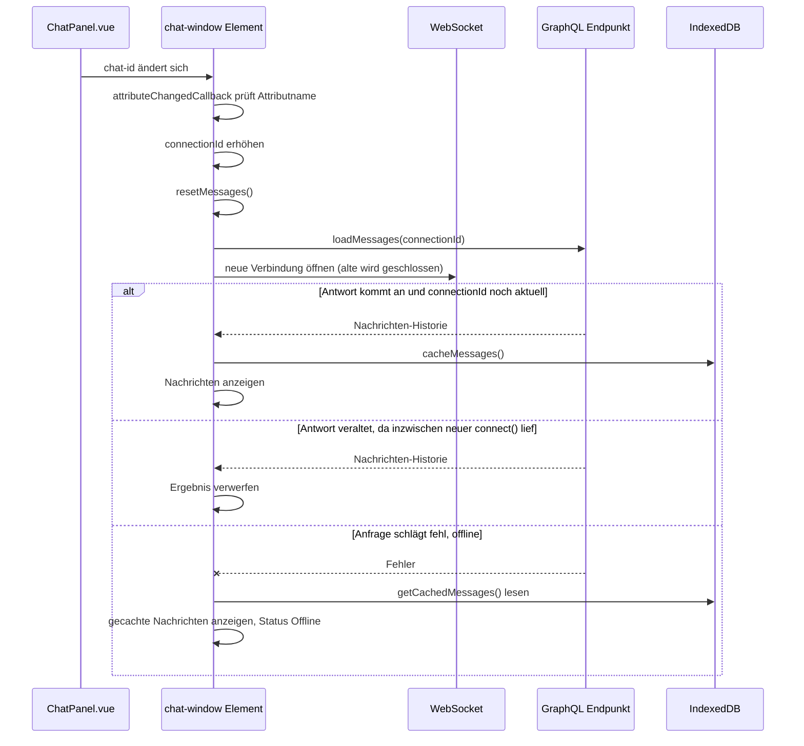
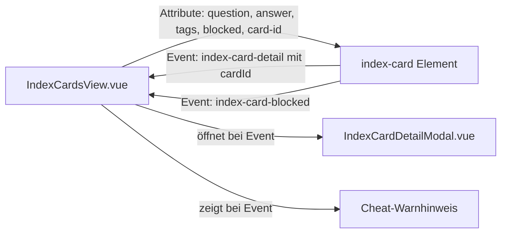

# Technische Dokumentation: Web Components

## 1. Überblick

Es wurden zwei eigenständige Web Components (Custom Elements, Shadow DOM) entwickelt, die unabhängig von Vue funktionieren und über Attribute und Events mit der umgebenden Anwendung kommunizieren:

| Component | Tag | Datei | Aufgabe |
| --- | --- | --- | --- |
| Chat-Fenster | `<chat-window>` | `ChatWindowElement.js` | Echtzeit-Chat einer Lerngruppe über einen rohen WebSocket |
| Karteikarte | `<index-card>` | `IndexCardElement.js` | Flip-Karte mit Frage/Antwort, Tags und Detail-Button |

Beide werden zentral registriert in `web-components/index.js` und global über `main.js` importiert. Vue selbst rendert sie über normale HTML-Tags, wobei Vite in `vite.config.js` explizit angewiesen wird, `index-*`- und `chat-*`-Tags als Custom Elements zu behandeln, statt sie als unbekannte Vue-Komponenten zu warnen:

```js
vue({
  template: {
    compilerOptions: {
      isCustomElement: (tag) => tag.startsWith('index-') || tag.startsWith('chat-')
    }
  }
})
```

## 2. `<index-card>` (`IndexCardElement.js`)

### Attribute

| Attribut | Typ | Beschreibung |
| --- | --- | --- |
| `question` | String | Fragetext (Vorderseite) |
| `answer` | String | Antworttext (Rückseite) |
| `creator` | String | Anzeigename des Erstellers |
| `tags` | JSON-String | Array von Tags, per `JSON.stringify`/`JSON.parse` serialisiert |
| `card-id` | String | ID der Karteikarte, wird in Events mitgegeben |
| `blocked` | String (`"true"`/`"false"`) | Sperrt Flip und Detail-Ansicht, z. B. während eines laufenden Runs |

Attribute statt Props, da Custom Elements nur Strings als Attribute unterstützen. Für `tags` (ein Array) wird deshalb über JSON serialisiert; für `blocked` (ein Boolean) wird der String `"true"`/`"false"` verglichen, da HTML-Attribute grundsätzlich Strings sind und ein gesetztes, aber leeres Attribut (`blocked=""`) sonst fälschlich als "vorhanden" durchgehen könnte.

### Verhalten

- Klick auf die Karte dreht sie per CSS `transform: rotateY(180deg)` (reine Optik, kein Datenverlust, da beide Seiten weiterhin im DOM liegen).
- Ist `blocked="true"` gesetzt, wird weder geflippt noch die Detail-Ansicht geöffnet. Stattdessen wird ein `index-card-blocked`-Event ausgelöst.
- Klick auf den Detail-Button löst ein `index-card-detail`-Event mit `detail: { cardId }` aus, statt selbst eine Detailansicht zu rendern — die Component bleibt bewusst reine Anzeige- und Interaktionslogik, das Öffnen eines Modals ist Aufgabe der Vue-Elternkomponente.

### Custom Events

| Event | `detail` | Ausgelöst wenn |
| --- | --- | --- |
| `index-card-detail` | `{ cardId }` | Detail-Button geklickt, Karte nicht blockiert |
| `index-card-blocked` | – | Interaktion versucht, während `blocked="true"` |

Beide Events werden mit `bubbles: true, composed: true` dispatcht, damit sie das Shadow-DOM-Grenze überschreiten und in `IndexCardsView.vue` per `document.addEventListener(...)` abgefangen werden können.

### Einbindung (`IndexCardsView.vue`)

```html
<index-card
  v-for="card in filteredCards"
  :key="card.id"
  :card-id="card.id"
  :question="card.question"
  :answer="card.answer"
  :creator="card.creator?.name || 'Unbekannt'"
  :tags="card.tags"
  :blocked="hasActiveRun"
/>
```

`hasActiveRun` kommt aus einer gepollten GraphQL-Query (`getActiveRun`, `pollInterval: 5000`) und sperrt alle Karten, sobald der Nutzer einen aktiven Run gestartet hat — das verhindert, dass er während eines Kampfes die Antworten der eigenen Karteikarten nachschlägt. Der Blockier-Versuch selbst wird zusätzlich als kleiner Anti-Cheat-Hinweis quittiert: `handleBlockedEvent` öffnet einen Wikipedia-Artikel zum Stichwort Täuschung und zeigt eine Warnmeldung im UI.

## 3. `<chat-window>` (`ChatWindowElement.js`)

### Attribute

| Attribut | Typ | Beschreibung |
| --- | --- | --- |
| `chat-id` | String | ID des Chats der aktuellen Lerngruppe |
| `token` | String | JWT für WebSocket-Join und GraphQL-Requests |
| `username` | String | Aktuell nur als Attribut vorhanden, im Rendering ungenutzt |
| `role` | String | Rolle des Nutzers in der Gruppe, steuert `canDelete` |

### Datenfluss: WebSocket + GraphQL nebeneinander

Die Component verbindet zwei Kommunikationswege, die im PROJEKT.md-Abschnitt "Sonderfall Chat" architektonisch begründet sind:

- **Historisches Laden** (`getMessages`, GraphQL Query, paginiert über einen `before`-Cursor): läuft über einen eigenen, direkten `fetch()`-Aufruf gegen `/graphql` — nicht über Apollo, da die Component außerhalb des Vue-/Apollo-Kontexts lebt.
- **Live-Nachrichten** (senden, empfangen, löschen): laufen über einen rohen WebSocket (`ws://localhost:3000/chat`), nicht über GraphQL Subscriptions.

### Offline-Anbindung

`loadMessages()` cached jede erfolgreich geladene Historie direkt über `cacheMessages()` aus `offlineStorage.service.js`. Schlägt der `fetch()`-Aufruf fehl (Offline-Fall), greift `loadMessages()` im `catch`-Block auf `getCachedMessages(chatId)` zurück und zeigt den Status `Offline` an. Live-Nachrichten über den WebSocket werden dagegen nicht zusätzlich in IndexedDB geschrieben — sie existieren nur, solange die Verbindung steht.

### Verbindungs-Handling und behobene Bugs

Beim Wechsel der Lerngruppe ändert sich `chat-id` (und oft gleichzeitig `role`). Zwei Aspekte sorgen dafür, dass daraus kein inkonsistenter Zustand entsteht:

- `attributeChangedCallback` reagiert bewusst nur auf `chat-id`/`token`, nicht auf jede Attributänderung — sonst würde ein gleichzeitiger `role`-Wechsel einen zweiten, parallelen `connect()`-Aufruf auslösen.
- Eine hochgezählte `_connectionId` ("Verbindungs-Generation") wird bei jedem `connect()` erhöht. Jede laufende `loadMessages()`-Anfrage prüft vor dem Anhängen der Ergebnisse, ob ihre `connectionId` noch der aktuellen entspricht — eine veraltete, spät zurückkommende Antwort eines vorherigen `connect()`-Aufrufs wird sonst verworfen, statt Nachrichten zu verdoppeln.
- `resetMessages()` leert Zustand und DOM vor jedem neuen `connect()`.
- Browser-`online`/`offline`-Events werden in `connectedCallback` registriert und in `disconnectedCallback` wieder entfernt, damit die Component auch reagiert, wenn sie bereits offen ist und sich der Netzwerkstatus währenddessen ändert (nicht erst beim erneuten Öffnen).

### Custom Events

| Event | Ausgelöst wenn |
| --- | --- |
| `chat-close` | Schließen-Button geklickt |

### Einbindung (`ChatPanel.vue`)

```html
<chat-window
  :chat-id="chatId"
  :token="token"
  :username="username"
  :role="role"
/>
```

`token` wird direkt aus `localStorage` gelesen (`computed(() => localStorage.getItem('token') || '')`), nicht aus einem zentralen Auth-Store — konsistent mit dem Rest der Anwendung, wo der Token nach dem OAuth-Callback ebenfalls in `localStorage` abgelegt wird.

## 4. Diagramm: Lifecycle von `<chat-window>` bei Gruppenwechsel



## 5. Diagramm: Interaktion Vue und `<index-card>`



## 6. Bekannte Einschränkungen

- `username` wird als Attribut an `<chat-window>` übergeben, aber im Rendering nicht verwendet (eigener Nutzername erscheint nicht gesondert hervorgehoben in der Nachrichtenliste).
- Live über WebSocket empfangene Nachrichten werden nicht zusätzlich in IndexedDB gespiegelt — nur die beim Laden der Historie abgerufenen. Bei einem Offline-Wechsel mitten in einer aktiven Chat-Sitzung fehlen entsprechend die zuletzt live empfangenen Nachrichten im Cache, bis erneut eine Historie geladen wurde.
- Doppelter Import von `IndexCardElement.js` in `index.js` (siehe Abschnitt 1) sollte vor der Abgabe bereinigt werden.
